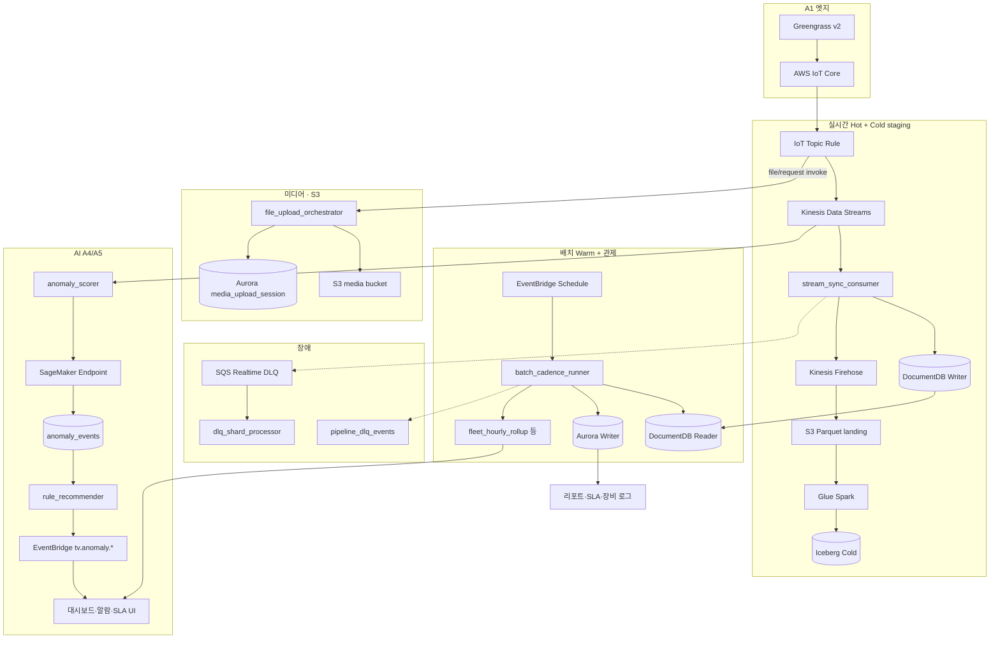

# 02. AWS 데이터 파이프라인

## 2.1 전체 흐름



## 2.2 AWS 서비스 역할

| 서비스 | 테크밸리 역할 |
|--------|---------------|
| **IoT Core** | MQTTS, Thing/Policy, Topic Rule → KDS |
| **Greengrass v2** | 엣지 수집·스풀·OTA 컴포넌트 |
| **Kinesis Data Streams** | 수집 버퍼 (PartitionKey=`device_code` / 장비 S/N) |
| **Lambda** | 정규화·변환·Hot/Cold 적재·배치 롤업 |
| **DocumentDB** | Hot — 원천·이벤트·단기 롤업 |
| **Kinesis Firehose** | 정규화 레코드 → S3 Parquet |
| **S3** | Firehose landing, FOTA·미디어, errors prefix |
| **Glue Spark + Catalog** | Parquet → Iceberg 커밋·컴팩션 |
| **Aurora PostgreSQL** | Warm — site·branch·company·장비 롤업, 티켓·SLA·알람 팩트 |
| **EventBridge** | 알람 룰, 배치 cadence, Iceberg 유지보수 |
| **SNS / SES** | Critical 알람 15분 SLA 1차 대응 알림 |
| **SageMaker** | 이상 탐지 inference·Feature Store·Edge Manager ([09-ai-anomaly-rules-and-edge-self-healing.md](./09-ai-anomaly-rules-and-edge-self-healing.md)) |
| **S3 (media)** | 검사 이미지·비디오 스트림·로그 — Presigned single/multipart ([13-media-upload-pipeline.md](./13-media-upload-pipeline.md)) |
| **SQS** | 실시간 처리 DLQ |
| **Cognito** | 운영 포털 인증 |
| **CloudWatch / CloudTrail** | 지연·오류·감사 |

## 2.3 표준 실시간 경로 (Hot + Cold)

1. 장비 → **IoT Core** (Topic Rule SQL 필터)
2. **KDS PutRecord** (내구성 버퍼)
3. **`stream_sync_consumer` Lambda**
   - 토픽 8세그먼트 파싱 + `normalize-config` 매칭
   - `rules/{rule_code}.json` 변환 (tube.kv, temp, yield 등)
   - **DocumentDB Writer** upsert (Hot)
   - **Firehose PutRecordBatch** (동일 정규화 출력 → Cold 경로)
4. 실패 레코드 → **SQS DLQ** → `dlq_shard_processor`

### 조직 스냅샷 (device → site → branch → company)

MQTT에는 org 코드가 없고 **`device_code`만** 전달됩니다. Hot 적재 시 DocDB 문서에 `site_id`·`customer_id`(=`company.code`)를 denormalize하고, Warm 배치는 device → site → **branch** → company grain으로 롤업합니다 ([org-hierarchy.md](./config/schema/org-hierarchy.md)).

**금지**: KDS → Firehose **병렬 직접 소비** (미변환 Raw가 Iceberg에 섞임).  
예외: 감사용 RAW 아카이브는 **별도 IoT Rule → 전용 Firehose** (Runbook).

## 2.4 표준 배치 경로 (Warm + 관제 롤업)

EventBridge → **`batch_cadence_runner`** → DocumentDB Reader 읽기 → Aurora Writer / Doc 롤업 적재.

### 테크밸리 UI 연동 배치 Job

| Job ID (scope.ts) | 산출 | UI 소비 |
|-------------------|------|---------|
| `aurora.fleet_hourly_rollup` | 플릿 상태·지역 집계 | 대시보드 지도·KPI |
| `aurora.dashboard_daily_aggregate` | 일별 KPI | 대시보드 차트 |
| `aurora.alarm_daily_rollup` | 알람 추세 | 알람·대시보드 패널 |
| `iceberg.yield_daily_rollup` | 수율 일별 | 검사·대시보드 수율 |
| `aurora.equipment_log_query` | Warm 카테고리별 로그 | 장비 로그 |
| `aurora.collection_daily_stats` | 수집 통계 | 데이터 파이프라인 |
| `documentdb.pipeline_tier_snapshot` | Tier 상태 | 파이프라인 Tier 설정 |

### 디바이스 시간 롤업 (DocumentDB)

```
periodic_telemetry → 10min → hour → day → month → year
(telemetry_rollups_device_*)
```

### Site·Branch·Company 팩트 (Aurora)

- **일 grain**: DocumentDB 디바이스 «일» 롤업을 `site_id`·`product_id`로 합산 → site → **branch** → company 체인
- **월·연**: RDS 내 직전 grain만 입력 (원시 로우 직접 집계 금지)

## 2.5 배치 스케줄 (기준)

| schedule_key | 용도 | EventBridge cron |
|--------------|------|------------------|
| `rollup_device_10min` | 디바이스 10분 롤업 | `cron(0/10 * * * ? *)` |
| `rollup_hourly` | 시간 롤업 + **fleet_hourly** | `cron(0 * * * ? *)` |
| `rollup_daily` | 일 롤업 + dashboard/alarm daily | `cron(5 0 * * ? *)` |
| `rollup_monthly` | 월 롤업 | `cron(0 2 1 * ? *)` |
| `communication_quality_eval_10m` | 통신품질·알람 입력 | `cron(30/10 * * * ? *)` |

## 2.6 알람 파이프라인

| 유형 | 경로 | 저장 |
|------|------|------|
| **Raw 알림** | 스트림 Lambda `alerts_raw` | DocumentDB Hot |
| **임계·복합 룰** | EventBridge Rule | SNS/SES + 티켓 트리거 |
| **집계 알림** | 배치 cadence (10min/hour 롤업 입력) | Aurora `communication_alarm_incident`, `notification` |

Critical SLA: 알람 발생(EventBridge) 시점 기준 **15분 내 1차 대응** (UI·기능정의서).

**SageMaker 이상 탐지** (임계 룰 보완): KDS/Lambda `anomaly_scorer` → SageMaker Endpoint → `anomaly_events` → 룰 추천·EventBridge `tv.anomaly.detected`. 상세: [09-ai-anomaly-rules-and-edge-self-healing.md](./09-ai-anomaly-rules-and-edge-self-healing.md) §9.3~9.5.

## 2.7 Greengrass 오프라인·복구 (A1)

네트워크 단절 시 **MQTT Disk Spooler(50MB)** · 엣지 로컬 저장 → 온라인 복귀 후 IoT Jobs·큐 메시지·미전송 파일 순차 동기화.

| 항목 | 요약 |
|------|------|
| Spooler | QoS 1 MQTT 디스크 큐, 재시작 후 유지, 복귀 시 자동 publish |
| IoT Jobs (OTA) | 오프라인 중 클라우드 **QUEUED**, 복귀 시 `notify-next` |
| 대용량 파일 | 로컬 `files/` 적재 → 복귀 후 Presigned 멀티파트 업로드 |
| URL 만료 | OTA CF URL(24h)·S3 Presigned(1h) — 재요청 토픽 + Lambda 재발급 |

상세 시퀀스·Runbook: **[08-greengrass-offline-resilience.md](./08-greengrass-offline-resilience.md)** (hiCAMS 패턴 테크밸리 적용).

## 2.8 원격진단·원격제어 (A5)

| 기능 | AWS | dataScope |
|------|-----|-----------|
| 원격진단 Job | Greengrass + IoT Jobs | batch (결과 스냅샷) + Hot edge |
| kV/mA 보정·안전모드 | Device Shadow, IoT Jobs | realtime (`iot.jobs + device.shadow`) |
| OTA | Greengrass OTA, Shadow 롤백 | 펌웨어 메트릭 + 설정 화면 |
| **엣지 자가복구** | IoT Jobs + self_heal_playbooks | SageMaker `edge_client` 분류 시 자동 Job ([09](./09-ai-anomaly-rules-and-edge-self-healing.md) §9.6) |

## 2.9 버퍼·DLQ 보존

| 구간 | 보존 |
|------|------|
| KDS | 7일 |
| SQS Realtime DLQ | 14일 |
| Firehose landing S3 | 7일 (Iceberg 커밋 후 Lifecycle 삭제) |
| Firehose errors prefix | 30일 |
| 배치 DLQ | DocumentDB `pipeline_dlq_events` |

## 2.10 MQTT 토픽 (8세그먼트 SSOT)

```
{tenant}/{env}/{edge}/{device}/{data_kind}/{domain}/{role}/json
```

| 세그먼트 | 테크밸리 예 |
|----------|-------------|
| data_kind | `periodic` · `event` |
| domain | `telemetry` · `fota` · `control` · `alarm` |
| role | `report` · `command` · `status` |

IoT Rule PartitionKey: **`device_code`** (= 장비 S/N).  
상세·금지 패턴: [05-yaml-and-rules.md](./05-yaml-and-rules.md).

## 2.11 Lambda 구현 (소스·개발)

다이어그램의 Lambda는 **`03.source/lambda/apps/`** 9종 handler로 구현합니다. NestJS가 아닌 **Node.js 24 ESM** + `@techvalley/pipeline-core`.

| app | 본 문서 § | 개발 SSOT |
|-----|-----------|-----------|
| `stream_sync_consumer` | §2.3 | [15-lambda-development.md](./15-lambda-development.md) |
| `dlq_shard_processor` | §2.3 fail | 동일 |
| `file_upload_orchestrator` | §2.1 media | [13-media-upload-pipeline.md](./13-media-upload-pipeline.md) |
| `batch_cadence_runner` | §2.4 | [05-yaml-and-rules.md](./05-yaml-and-rules.md) §5.5 |
| `anomaly_scorer` · `rule_recommender` · `self_heal_orchestrator` | §2.1 ml | [09-ai-anomaly-rules-and-edge-self-healing.md](./09-ai-anomaly-rules-and-edge-self-healing.md) |

```bash
cd 03.source/lambda && npm run lambda:assets && npm run test:local:ingress
```

배포: `npm run predeploy` → Terraform ([10-yaml-pipeline-deploy-automation.md](./10-yaml-pipeline-deploy-automation.md)).
