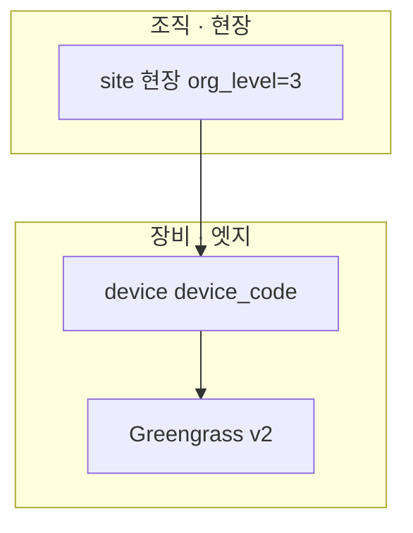
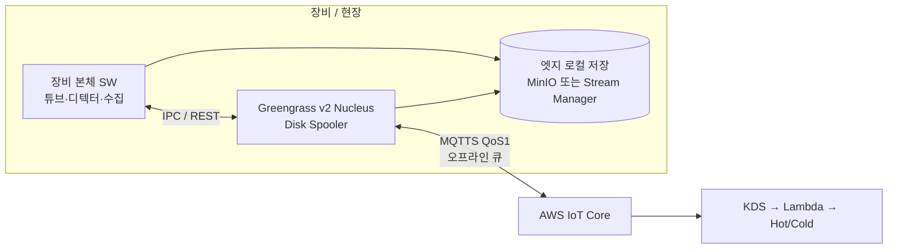
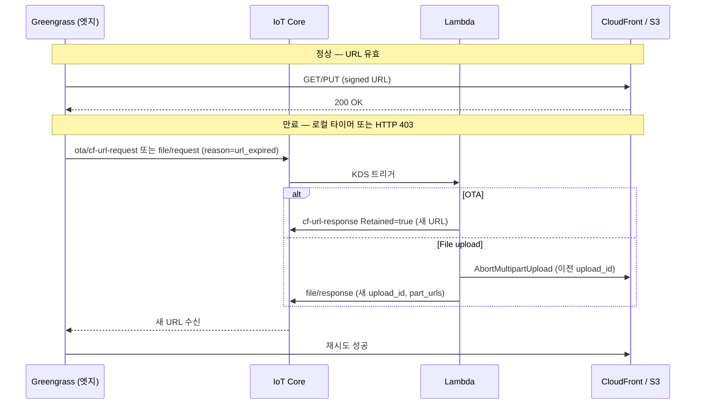

# 08. Greengrass 오프라인·복구 프로세스

기능정의서 A1(네트워크 단절 시 **스풀·재동기화**)과 [hiCAMS 아키텍처](https://hd-ksoe.vercel.app/)의 Greengrass V2 오프라인 패턴을 **테크밸리 장비 엣지** 기준으로 정리한 SSOT입니다.

## 8.1 엣지 구성 (현장 · 장비)

조직: `company` → `branch` → `site`(현장) → `device` → Greengrass ([org-hierarchy.md](./config/schema/org-hierarchy.md))





| 컴포넌트 | 역할 (테크밸리) |
|----------|----------------|
| **Greengrass Nucleus** | Thing 인증서·TLS, IPC 허브, **Disk Spooler**, 자동 재연결 |
| **OTA Controller** (GG 컴포넌트) | IoT Jobs 수신 → 펌웨어·컴포넌트 배포 |
| **Stream / Upload 컴포넌트** | 대용량(검사 이미지·로그) S3 멀티파트 업로드 |
| **장비 본체 SW** | tube.kv·디텍터·주기 보고 생성, GG IPC로 MQTT 발행 |
| **엣지 로컬 저장** | 오프라인 중 펌웨어 tar·미전송 파일·버퍼 보관 |

UI 연동: 알람 «Greengrass 연결 끊김 — 스풀 버퍼 N MB», 장비 로그 **본체** 카테고리(Greengrass·가동시간), `equipment` 상태 `offline` / `safe_mode`.

## 8.2 Nucleus Disk Spooler (MQTT 큐잉)

오프라인·불안정 네트워크에서 **MQTT 유실 방지**의 1차 수단입니다.

```yaml
# Greengrass Nucleus config (기준값 — hiCAMS·테크밸리 공통)
mqtt:
  spooler:
    storageType: Disk          # 재시작 후에도 유지
    maxSizeInBytes: 52428800   # 50MB
    keepQos0WhenOffline: false # QoS 0는 오프라인 시 폐기
```

| 항목 | 동작 |
|------|------|
| **저장 대상** | QoS **1** MQTT (주기 텔레메트리, 이벤트, OTA/file 상태, 알람) |
| **용량 초과** | FIFO 또는 정책에 따라 오래된 메시지 drop — CloudWatch·엣지 알람 |
| **재시작** | Disk 저장이므로 GG 프로세스 재기동 후에도 큐 유지 |
| **온라인 복귀** | Nucleus 자동 재연결 → **큐에 쌓인 QoS 1 메시지 순차 발행** |

QoS 0(일회성 heartbeat 등)은 오프라인 시 저장하지 않음 — 실시간성만 필요한 low-priority에만 사용.

## 8.3 오프라인 → 온라인 복귀 시나리오

hiCAMS «오프라인 → 온라인 복귀 시나리오»를 테크밸리 도메인에 매핑한 표입니다.

| 상태 | 동작 | 보장 수단 |
|------|------|-----------|
| **오프라인 중 IoT Jobs 생성** (OTA·원격진단) | 클라우드에서 Job **QUEUED** 유지 | IoT Jobs 상태 관리 |
| **오프라인 중 텔레메트리·이벤트 발생** | Disk Spooler(50MB)에 MQTT 큐잉 | GG Nucleus Spooler |
| **오프라인 중 대용량 파일 적재** | 엣지 로컬 `files/` 버킷에 저장 | MinIO / Stream Manager |
| **온라인 복귀 (일반)** | Pending Jobs 자동 수신(`notify-next`), 큐 메시지 자동 발행 | GG 자동 재연결 |
| **온라인 복귀 — Signed URL 만료** | Retained/로컬 `expires_in` 확인 → 만료 시 **재요청 토픽** 발행 | 엣지 재요청 + Lambda 재발급 |
| **온라인 복귀 — 미업로드 파일** | `file/request` 재발행 → 새 Presigned URL → 업로드 재개 | S3 멀티파트 재시작 |
| **복귀 후 클라우드 반영** | KDS → Lambda → DocumentDB Hot · Aurora Warm | 기존 실시간 파이프라인 |

### 복귀 후 처리 순서 (권장)

```
1. Nucleus TLS 재연결
2. IoT Jobs notify-next 수신 (대기 중 OTA·진단 Job)
3. Disk Spooler 적재 MQTT 순차 publish (발생 시각·seq 메타 유지)
4. 엣지 로컬 files/ 스캔 → 미전송 건 file/request
5. (선택) communication_quality 배치가 gap·지연 감지 → 알람 해제/티켓 업데이트
```

## 8.4 데이터 종류별 오프라인 처리

### 8.4.1 주기·이벤트 텔레메트리 (A1)

| 항목 | 내용 |
|------|------|
| **토픽** | `tv/{env}/{edge}/{device}/periodic/telemetry/report/json` 등 |
| **오프라인** | GG Spooler에 QoS 1로 적재 (tube.kv, temp, yield) |
| **복귀** | 시간순 publish → IoT Rule → KDS → Lambda → **DocumentDB Hot** |
| **UI** | 메트릭 스트림은 복귀 후 catch-up; 대시보드 KPI는 **배치 롤업**만 반영 |
| **주의** | KDS 보존(7일) < 장기 오프라인이면 Spooler 용량·로컬 ring buffer 정책 필요 |

### 8.4.2 OTA · Greengrass 컴포넌트 (A1 · settings/firmware)

| 단계 | 오프라인 | 온라인 복귀 |
|------|----------|-------------|
| Job 생성 | 클라우드 **QUEUED** | `notify-next` → jobDocument의 `signed_url`로 다운로드 |
| 다운로드 중 단절 | CF/로컬 partial 파일 | checksum 실패 시 재다운로드 |
| URL 만료 (24h) | — | `event/ota/cf-url-request/json` → Lambda → **Retained** `cf-url-response` |
| 설치 완료 | 상태 MQTT Spooler 적재 | `$aws/things/.../jobs/.../update` + 커스텀 `ota/status` → Aurora |

**핵심**: 정상 OTA는 jobDocument에 **CF Signed URL** 포함 — 별도 MQTT 왕복 없이 즉시 다운로드. 만료·403 시에만 재요청.

### 8.4.3 대용량 파일 (검사 이미지 · 로그 export · files_history)

MQTT는 **제어·메타만** — 페이로드 본문은 **Presigned PUT**으로 S3 직접 업로드 (hiCAMS file 도메인 패턴).

```
오프라인:  장비 SW → 엣지 files/ 로컬 PUT
온라인:    file/request/json → Lambda CreateMultipartUpload
           file/response/json (upload_id, part_urls, expires_in: 3600)
           MinIO/files GET → S3 PUT (파트별)
           file/complete/json → Lambda CompleteMultipartUpload → Aurora files COMPLETED
```

| URL 유형 | 유효시간 | 만료 시 |
|----------|----------|---------|
| OTA CF Signed URL | 86400s (24h) | `ota/cf-url-request` → Retained 덮어쓰기 |
| S3 Presigned (파트) | 3600s (1h) | `file/request` 재발행 + **AbortMultipartUpload**(이전 upload_id) |

### 8.4.4 원격제어 · Shadow (A5)

| 항목 | 오프라인 동작 |
|------|---------------|
| **Shadow desired** | 클라우드에 저장, 디바이스 offline 시 delta 미전달 |
| **복귀** | GG가 Shadow sync → desired delta 적용 → reported 갱신 |
| **IoT Jobs (제어)** | QUEUED 유지, 복귀 후 실행 — Fail-safe 인터락은 **엣지 로컬**에서 우선 |

UI `remote-control`은 Hot Tier — 연결 끊김 시 «오프라인» 표시, 명령 큐는 클라우드 Job/Shadow에 보관.

## 8.5 URL 만료·재요청 흐름



## 8.6 엣지 로컬 저장소 (MinIO / Stream Manager)

hiCAMS MinIO 2버킷 패턴을 테크밸리에 적용합니다.

| 버킷 (로컬) | 용도 | 오프라인 | 온라인 복귀 |
|-------------|------|----------|-------------|
| **firmware/** | Greengrass OTA tar·컴포넌트 아티팩트 | CF 다운로드 완료까지 로컬 보관 | Webhook → 배포 오케스트레이션 → `docker load` / GG deploy |
| **files/** | 검사 이미지, 튜브 로그 export, 대용량 첨부 | **로컬 PUT 계속 가능** | GG Upload 컴포넌트 → S3 멀티파트 |
| **spool/** (선택) | Stream Manager ring buffer | KDS 초과분·고빈도 주기 | GG → MQTT 재전송 |

로컬 저장 용량·디스크 임계치는 **본체** Warm 로그·알람(«스풀 버퍼 2.4MB» 등)과 연동해 모니터링.

## 8.7 클라우드·UI 반영

| 관측 | 저장·표시 |
|------|-----------|
| GG connectivity | Device Shadow `connectivity`, CloudWatch IoT |
| Spooler 사용량 | 엣지 메트릭 → `communication_quality_rollups` |
| 마지막 telemetry 시각 | DocumentDB Hot → 플릿 지도 `offline` |
| 복귀 후 backlog drain | Hot lagMs 감소, `data-pipeline` 실시간 패널 |
| 장기 단절 SLA | EventBridge → `communication_alarm_incident` → 티켓 |

**배치 vs 실시간**: 오프라인 기간 KPI·알람 집계는 복귀 후 **hourly/daily 롤업**에 반영. 실시간 화면은 복구 직후 catch-up 구간을 lag으로 표시.

## 8.8 MQTT 토픽 (오프라인·복구 관련)

테크밸리 8세그먼트 (`05-yaml-and-rules.md` 참고). `tenant`는 플랫폼 코드 `tv` — **회사(`company.code`)는 토픽에 넣지 않습니다** (조직은 `device` 마스터 조인).

| domain | role | 방향 | 용도 |
|--------|------|------|------|
| `ota` | `cf-url-request` | ↑ | CF Signed URL 재발급 요청 |
| `ota` | `cf-url-response` | ↓ Retained | 재발급 URL (OTA만 Retained) |
| `ota` | `progress` / `status` | ↑ | OTA 진행·완료 (Spooler 경유 가능) |
| `file` | `request` / `response` / `chunk` / `stream` / `progress` / `complete` / `abort` | ↑↓ | S3 단일·멀티파트·이미지청크·비디오 ([13](./13-media-upload-pipeline.md)) |
| `telemetry` | `report` | ↑ | 주기·이벤트 (Spooler 경유) |
| `alarm` | `{kind}` | ↑ | 연결 끊김·Spooler 임계 등 |

IoT Jobs 시스템 토픽 (`$aws/things/{thing}/jobs/notify-next`)은 Nucleus가 **자동 구독** — 오프라인 Job은 복귀 시 자동 전달.

## 8.9 운영 Runbook (요약)

1. **단기 단절 (< Spooler 50MB)**: 자동 복구 대기 — 수동 개입 불필요
2. **Spooler 임계 80%**: 현장 네트워크 점검, 알람 «Greengrass 연결 끊김» 확인
3. **Spooler full**: QoS1 drop 정책 발동 — 우선순위(알람 > event > periodic) 재정렬 검토
4. **장기 단절 (> KDS 7일)**: 엣지 로컬 files/·ring buffer 확인, 현장 USB/export 또는 네트워크 복구 후 **수동 replay** Runbook
5. **OTA URL 만료**: Job `IN_PROGRESS` + 403 → cf-url-request 자동 — 24h 내 현장 복구 권장
6. **파일 upload stuck**: Aurora `files.status=PENDING` + upload_id → Abort 후 재요청

## 8.10 참고 출처

- [hiCAMS 시스템 아키텍처 — 오프라인 → 온라인 복귀](https://hd-ksoe.vercel.app/) (Disk Spooler 50MB, IoT Jobs QUEUED, URL 재발급)
- 테크밸리 기능정의서 A1: «네트워크 단절 시 스풀·재동기화»
- [02-data-pipeline.md](./02-data-pipeline.md) — KDS·Lambda·Hot 경로
- [05-yaml-and-rules.md](./05-yaml-and-rules.md) — ota/file 도메인 토픽
- [09-ai-anomaly-rules-and-edge-self-healing.md](./09-ai-anomaly-rules-and-edge-self-healing.md) — SageMaker `edge_client` 분류 시 OTA·self-heal Job 연동, 제품 개선 루프
- [15-lambda-development.md](./15-lambda-development.md) — `file_upload_orchestrator` · Presign 재발급
