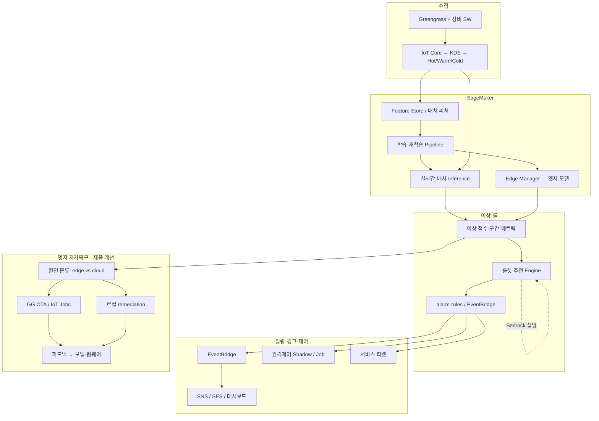
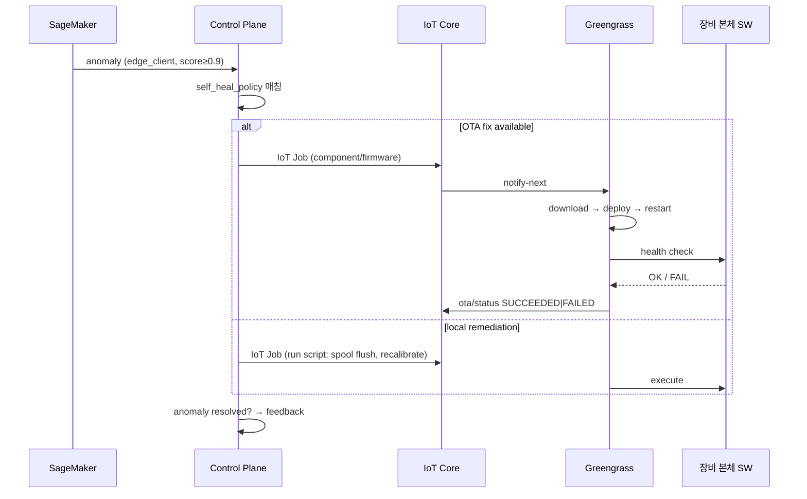

# 09. AI 이상 감지 · 룰셋 추천 · 엣지 자가복구

테크밸리 IoT 플랫폼의 **운영 AI** SSOT입니다.  
기능정의서 **A4(알람·룰셋)·A5(원격진단/제어)** 와 연계하며, 제안서 **D(Bedrock·RAG)** 는 보조·설명 계층으로 분리합니다.

## 9.1 AI 계층 구분

| 계층 | 기술 | 역할 | 범위 |
|------|------|------|------|
| **운영 AI (본 문서)** | **Amazon SageMaker** | 센서 이상 탐지, 룰셋 추천, 자동/반자동 알림·제어 트리거 | **IoT A4/A5 — 포함** |
| **엣지 AI** | SageMaker Edge Manager / GG 컴포넌트 | 현장 단독 이상 판정·자가복구 Job | **A1/A5 — 포함** |
| **지원 AI (D)** | Bedrock + RAG | 매뉴얼·정비 이력 검색, 조치 문구·리포트 초안, 챗봇 | 별도 영역, **사람 확인 후** 실행 |
| **제외** | 제조 AI·MES 심화 | 공정·LOT 최적화 등 Project B | 본 아키텍처 범위 밖 |

**원칙**: SageMaker가 **수치 이상·패턴**을 감지하고, Bedrock은 **설명·문서·추천 문구**를 보강. 최종 룰 배포·원격제어·티켓 확정은 **RBAC + 정책(자동/승인)** 으로 통제.

## 9.2 전체 흐름



## 9.3 SageMaker — 이상 센서 데이터 감지

### 9.3.1 대상 메트릭 (테크밸리)

| 도메인 | 메트릭 예 | UI·로그 |
|--------|-----------|---------|
| 튜브 | `tube.kv`, `tube.ma`, drift, 수명 | metric-stream `#periodic`, 장비 로그 **튜브** |
| 디텍터 | `detector.temp_c`, dead pixel proxy, yield | **디텍터**, inspection |
| 본체 | Greengrass connectivity, spool usage, uptime | **본체**, 알람 |
| 통신 | message gap, `ReplicaLag` proxy, spool buffer | data-pipeline, SLA |

### 9.3.2 데이터 소스·피처

| 용도 | 소스 | 갱신 |
|------|------|------|
| 학습·재학습 | Iceberg `stream_fact_telemetry`, Aurora rollups | 일/주 배치 |
| 실시간 추론 입력 | DocumentDB Hot `periodic_telemetry`, KDS 스트림 | 초~분 |
| Feature Store | SageMaker Feature Group (device_code, metric, window stats) | stream/batch ingest |

### 9.3.3 모델·배포 패턴

| 패턴 | 적용 | AWS |
|------|------|-----|
| **다변량 이상** | tube.kv + temp + yield 동시 drift | Random Cut Forest / DeepAR / custom autoencoder |
| **시계열 baseline** | 장비·Site별 seasonality | SageMaker Canvas 또는 Processing Job |
| **클라우드 실시간** | KDS/Lambda 후 SageMaker **Endpoint** invoke | Lambda `anomaly_scorer` |
| **배치 스코oring** | hourly rollup 후 이상 구간 태깅 | EventBridge → SageMaker Batch Transform |
| **엣지** | 네트워크 단절·저지연 판정 | **SageMaker Edge Manager** + GG 컴포넌트 |

### 9.3.4 이상 출력 스키마 (표준)

```json
{
  "anomaly_id": "anom-20260606-001",
  "device_code": "HK-2024-00158",
  "site_id": "site-001",
  "detected_at": "2026-06-06T14:12:00+09:00",
  "model_id": "tv-tube-multivariate-v3",
  "anomaly_score": 0.92,
  "severity_hint": "critical",
  "metrics": [
    { "name": "tube.kv", "value": 142.1, "baseline": 120.0, "z_score": 3.8 }
  ],
  "pattern": "sudden_spike",
  "root_cause_hint": "edge_client",
  "confidence": 0.87
}
```

저장: Aurora `anomaly_events`, DocumentDB Hot(단기), Iceberg(학습 피드백).

## 9.4 룰셋 추천

SageMaker 이상 탐지 결과 → **추천 룰 후보** 생성 → 운영자 승인 → EventBridge·알람 룰 반영.

### 9.4.1 추천 파이프라인

```
anomaly_events (신규·반복 패턴)
  → Rule Recommendation Service
       ├─ 유사 과거 알람·AS 이력 조회 (Aurora)
       ├─ (선택) Bedrock: 임계·복합 조건 자연어 → JSON 초안 + 근거
       └─ rule_recommendations 레코드 생성
  → alarm-rules UI: 검토 · 수정 · 승인 · 배포
  → notification_ruleset_mirror + EventBridge Rule 업데이트
```

### 9.4.2 추천 룰 예시

| 이상 패턴 | 추천 룰 (초안) | severity |
|-----------|----------------|----------|
| tube.kv drift > 3σ 지속 10min | `tube.kv > baseline + 4 AND duration > 600s` | warning → critical |
| detector temp + dead pixel proxy | 복합: temp > 65°C AND yield drop > 5% | critical |
| Greengrass spool > 80% + gap | connectivity alarm + 티켓 자동 | warning |
| 반복 edge_client 분류 | OTA 컴포넌트 업데이트 Job + 모니터링 룰 | info |

### 9.4.3 승인·거버넌스

| 단계 | 주체 | 결과 |
|------|------|------|
| `draft` | AI + engineer | UI alarm-rules «추천» 탭 |
| `approved` | admin/engineer RBAC | EventBridge·ruleset 배포 |
| `rejected` | — | 피드백 → 재학습 negative sample |
| `auto_approved` | 정책 (low-risk only) | 예: info급 connectivity만 |

**금지**: Critical 룰·원격 kV/mA 제어 룰의 **무승인 자동 배포**.

## 9.5 알림 · 경고 · 제어

기능정의서 A4·원격 해결 가능성 판정·UI `remote-diagnosis` / `alarms` / `remote-control` 과 연결.

### 9.5.1 severity → 액션 매트릭스

| severity | 알림 | 경고 UI | 제어 | 티켓 |
|----------|------|---------|------|------|
| **info** | 대시보드·로그 | — | — | — |
| **warning** | SNS(엔지니어), alarm 목록 | metric-stream 하이라이트 | Shadow 제안(승인) | 선택 |
| **critical** | SNS+SES, SLA 15분 | EMG·원격진단 | **즉시 원격가능** 시 Job/Shadow | 자동 접수 |

### 9.5.2 제어 정책 (Fail-safe)

| 조건 | 자동 제어 허용 | 예 |
|------|----------------|-----|
| `root_cause_hint=cloud` | 제한적 | 알람만, 제어는 사람 |
| `root_cause_hint=edge_client` + 신뢰도 ≥ 0.9 + 정책 on | **엣지 자가복구 Job** | spool flush script, GG restart |
| tube drift + «즉시 원격가능» | kV/mA 보정 Job | remote-control (A5) |
| dead pixel > threshold | 제어 불가 | 티켓·부품 발주 |

모든 자동 제어: **Shadow reported 검증** → 실패 시 safe_mode + 티켓.

### 9.5.3 EventBridge 연동

| 이벤트 | source | target |
|--------|--------|--------|
| `tv.anomaly.detected` | SageMaker/Lambda | SNS, alarm_events, rule recommender |
| `tv.rule.recommendation.created` | Rule Service | alarm-rules UI notification |
| `tv.control.auto.executed` | Remote Service | 감사 로그, equipment-logs **원격제어** |
| `tv.edge.self_heal.started` | GG / IoT Jobs | OTA progress, dashboard |

## 9.6 엣지 자가복구 · 제품 개선 루프

**클라이언트(엣지·장비 SW) 이슈**는 현장 방문 없이 **OTA·컴포넌트 업데이트**로 해결하고, 결과를 제품에 반영하는 **지속 개선** 구조입니다.

### 9.6.1 원인 분류

| 분류 | `root_cause_hint` | 대응 |
|------|-------------------|------|
| **엣지·클라이언트** | `edge_client` | GG OTA, 로컬 script, 장비 SW patch |
| **네트워크** | `network` | Spooler·재동기화 ([08-greengrass-offline-resilience.md](./08-greengrass-offline-resilience.md)) |
| **센서·하드웨어** | `hardware` | 티켓·부품 (A10/A11) |
| **클라우드·설정** | `cloud_config` | 룰·파라미터 수정 |

분류: SageMaker 다변량 모델 + 엣지 진단 Job(`remote-diagnosis`) + (선택) Bedrock 설명.

### 9.6.2 자가복구 실행 (edge_client)



OTA 경로: [08-greengrass-offline-resilience.md](./08-greengrass-offline-resilience.md) §8.4.2.

### 9.6.3 제품 개선 사이클 (Continuous Improvement)

```
① 현장 이상·알람·AS 이력 수집 (Warm/Cold)
② SageMaker: 반복 edge_client 패턴·fix 성공률 분석
③ 엔지니어링: 근본 수정 → firmware/component 새 버전 (GitLab CI → S3/CF)
④ canary 배포: site·Thing Group 일부 → 모니터링
⑤ 성공률·이상률 개선 확인 → 전체 플릿 rollout
⑥ 모델·룰·self_heal_policy 버전 갱신 (MLflow / Model Registry)
```

| 산출물 | 저장 | UI |
|--------|------|-----|
| `firmwares` / GG component version | Aurora + S3 | settings/firmware |
| `self_heal_playbooks` | Aurora JSON | admin (신규) |
| `fix_effectiveness` | Iceberg | reports |
| OTA campaign | `ota_campaigns` | equipment 펌웨어 탭 |

**목표**: 동일 `edge_client` 알람의 **재발률 감소**, MTTR 단축, 현장 출동 감소.

### 9.6.4 자가복구 정책 예 (`self_heal_playbooks`)

| playbook_id | 트리거 | 엣지 액션 | 성공 판정 |
|-------------|--------|-----------|-----------|
| `gg-spool-flush-v1` | spool > 80% + connectivity restore | Job: flush + resync | 10min 내 telemetry gap 해소 |
| `tube-recal-v2` | kv drift warning, edge_client | Shadow kV offset + local cal | drift < 1σ within 30min |
| `gg-component-restart-v1` | repeated MQTT publish fail | GG nucleus soft restart | connectivity=online 5min |
| `firmware-hotfix-v1.2.1` | known bug signature | OTA tar (canary group) | anomaly rate ↓ 7d |

실패 시: safe_mode → 티켓 → Bedrock RAG 조치 가이드(D3) 핸드오프.

## 9.7 Bedrock·RAG 연동 (D — 보조)

| SageMaker (운영 AI) | Bedrock (지원 AI) |
|---------------------|-------------------|
| 이상 score·패턴·수치 | «왜 tube drift인가» 설명 |
| 룰 JSON 초안 (structured) | 매뉴얼·AS 유사 사례 인용 |
| edge vs hardware 분류 feature | 챗봇 트러블슈팅 단계 |
| — | 서비스 리포트 초안 |

Bedrock 호출: IAM Role + Guardrails, PII 마스킹 (기능정의서 §⑤).  
**실제 제어·룰 배포는 SageMaker/Rule Service 경로만** — Bedrock은 read-only advisory.

## 9.8 UI·WBS 매핑

| 화면 | AI 기능 |
|------|---------|
| `/alarms` | SageMaker 기반 이상 + 기존 임계 룰 |
| `/alarm-rules` | **룰셋 추천** 승인·배포 |
| `/remote-diagnosis` | Edge Job + SageMaker finding 통합 |
| `/remote-control` | 자동/수동 제어, self-heal 결과 |
| `/metric-stream` | 실시간 anomaly overlay |
| `/data-pipeline` | 모델 lag·inference health |
| `/settings/firmware` | OTA canary·self-heal 연계 |
| (D) 진단 챗봇 | Bedrock RAG — 별도 모듈 |

WBS: **A4** (룰·알람), **A5** (진단·제어·자가복구), **M4** (Lambda inference), **M6** (티켓 연계), **신규 AI** (SageMaker pipeline).

## 9.9 AWS 리소스 (목표)

| 리소스 | 용도 |
|--------|------|
| SageMaker Feature Store | device×metric 피처 |
| SageMaker Pipelines | 학습·재학습 CI |
| SageMaker Endpoint / Batch | 실시간·배치 inference |
| SageMaker Model Registry | 버전·canary |
| SageMaker Edge Manager | GG 엣지 모델 배포 |
| S3 `ml-artifacts/` | 모델·학습 데이터 |
| Lambda `anomaly_scorer`, `rule_recommender` | KDS·EventBridge 연동 |
| EventBridge | `tv.anomaly.*`, `tv.self_heal.*` |
| Aurora | `anomaly_events`, `rule_recommendations`, `self_heal_playbooks`, `self_heal_executions` |
| Bedrock (선택) | 설명·RAG — D 영역 |

## 9.10 스키마 (요약)

| 테이블/컬렉션 | 용도 |
|---------------|------|
| `anomaly_events` | SageMaker inference 결과 |
| `rule_recommendations` | 추천 룰 draft/approved/rejected |
| `self_heal_playbooks` | edge_client 자동복구 시나리오 |
| `self_heal_executions` | Job 실행·성공률·피드백 |
| `model_registry_mirror` | 배포 모델 버전·지표 |
| `fix_effectiveness_daily` | Iceberg — 제품 개선 KPI |

상세 UI 매핑: [06-schema-reference.md](./06-schema-reference.md).

## 9.11 운영·안전

- **Human-in-the-loop**: Critical 알람·kV 제어·신규 Critical 룰은 승인 필수
- **Canary**: OTA·self_heal playbook은 Thing Group canary → 전체
- **Rollback**: GG Shadow rollback, firmware DEPRECATED (기능정의서 OTA)
- **감사**: CloudTrail + `equipment-logs` **감사** + 원격제어 이력
- **모델 드리프트**: 주간 재학습, anomaly false positive rate 모니터링

## 9.12 참고

- 기능정의서 A4(이상 알람·룰셋), A5(원격진단/제어), D(Bedrock·RAG)
- [02-data-pipeline.md](./02-data-pipeline.md) — KDS·Hot 입력
- [08-greengrass-offline-resilience.md](./08-greengrass-offline-resilience.md) — OTA·Job
- UI mock: `remote-diagnosis.ts`, `alarms`, `alarm-rules`
- [15-lambda-development.md](./15-lambda-development.md) — `anomaly_scorer`, `rule_recommender`, `self_heal_orchestrator` handler
