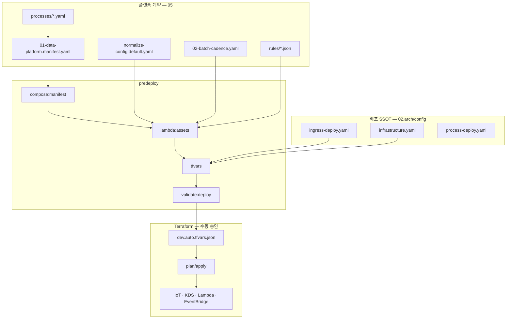

# 10. YAML 파이프라인 자동 배포

테크밸리 IoT 플랫폼의 **YAML → predeploy → Terraform** 자동 배포 SSOT입니다.  
설정 원본: **`02.arch/config/`** · Lambda: **`03.source/lambda/`** · IaC: **`90.infra/`**

## 10.1 구현 상태

| 구성요소 | SSOT 경로 | 상태 |
|----------|-----------|------|
| ingress-deploy | `02.arch/config/ingress-deploy.yaml` | 완료 |
| infrastructure | `02.arch/config/infrastructure.yaml` | 완료 |
| process-deploy | `02.arch/config/process-deploy.yaml` | 완료 |
| manifest + processes | `02.arch/config/manifest/` | 완료 |
| converter-rules + rules JSON | `02.arch/config/converter-rules/` · `rules/` | 완료 (**13종**) |
| predeploy scripts | `03.source/lambda/scripts/` | 완료 |
| Lambda 앱 소스 | `03.source/lambda/apps/` | 골격 (**9종**) — [15-lambda-development.md](./15-lambda-development.md) |
| Terraform modules | `90.infra/terraform/` | 골격 (6모듈, validate) |

## 10.2 배포 원칙

1. **플랫폼 계약 YAML**과 **AWS 배포 형태**를 분리한다.
2. 운영 수치·Lambda·KDS·EventBridge cron → **`ingress-deploy.yaml` 단일 SSOT**.
3. IoT Rule on/off·IAM·레이크/DB 스위치 → **`infrastructure.yaml`**.
4. IoT Rule SQL·topic_filter → **manifest `iot_rules.rules[]`** (processes compose).
5. cadence **의미** → **`02-batch-cadence.yaml`**.
6. **`npm run predeploy`는 AWS 배포를 하지 않는다** — 번들·tfvars·정합 검증만. `terraform apply`는 별도 승인.

## 10.3 설정 5층 + 배포 3층



| 층 | 파일 | 수정 시점 |
|----|------|-----------|
| A. 매니페스트 | `manifest/01-data-platform.manifest.yaml` | processes 수정 후 compose |
| B. 정규화 | `normalize-config.default.yaml` | 토픽·collection·rule_code |
| C. 배치 | `02-batch-cadence.yaml` | cadence·depends_on |
| D. 규칙 | `rules/*.json` | 페이로드 변환·alerts_raw |
| E. ingress-deploy | `ingress-deploy.yaml` | Lambda·KDS·EventBridge cron |
| F. infrastructure | `infrastructure.yaml` | IoT·IAM·레이크 |
| G. process-deploy | `process-deploy.yaml` | 로컬 E2E |

## 10.4 ingress-deploy.yaml

SSOT: **`02.arch/config/ingress-deploy.yaml`**

### 10.4.1 최상위 키

| 키 | 역할 |
|----|------|
| `project` | `name: tv-ingress`, `aws_region`, `environment`, `tags` |
| `partition_key` | `device_code` (장비 S/N) |
| `lambda_package` | runtime nodejs24.x, architecture arm64 |
| `lambdas.*` | memory·timeout·deploy_group |
| `streams.*` | KDS·ESM·DLQ |
| `batch.schedules[]` | EventBridge cron SSOT |
| `ml.eventbridge` | anomaly_scorer, rule_recommender, self_heal |

### 10.4.2 Lambda deploy_group

| deploy_group | 함수 |
|--------------|------|
| `ingress` | stream_sync_consumer, dlq_shard_processor, file_upload_orchestrator |
| `batch` | batch_cadence_runner, batch_dlq_replay |
| `invoke_only` | payload_converter |
| `ml` | anomaly_scorer, rule_recommender, self_heal_orchestrator |

### 10.4.3 streams

| 키 | 테크밸리 기본 |
|----|---------------|
| `ingest_main` | ON_DEMAND, retention 168h, batch_size 100 |
| `ingest_events_isolated` | disabled (분리 KDS 필요 시 enable) |

### 10.4.4 batch.schedules

배치는 **EventBridge → batch_cadence_runner** (Nest Cron 사용 안 함).

| schedule_key | AWS cron |
|--------------|----------|
| rollup_device_10min | `cron(0/10 * * * ? *)` |
| rollup_hourly | `cron(0 * * * ? *)` |
| rollup_daily | `cron(5 0 * * ? *)` |
| fleet_hourly_export | `cron(15 * * * ? *)` |

## 10.5 infrastructure.yaml

| 키 | dev 기본 | Terraform |
|----|----------|-----------|
| `iot.enabled` | true | IoT Rule → KDS |
| `analytics_lake.enabled` | true | Firehose · S3 · Glue |
| `data_plane.enabled` | false | DocumentDB/RDS (운영 시 enable) |

## 10.6 manifest deploy_binding

```yaml
deploy_binding:
  root: 02.arch/config
  config_ref: 02.arch/config/ingress-deploy.yaml
  terraform_dir: 90.infra/terraform
  lambdas_dir: 03.source/lambda/apps
  lambdas_core_package: 03.source/lambda/packages/pipeline-core
  batch_scheduler:
    schedules_ref: 02.arch/config/ingress-deploy.yaml#batch.schedules
```

## 10.7 predeploy (npm scripts)

| script | 동작 |
|--------|------|
| `compose:manifest` | processes → manifest 합성 |
| `rules:build` | converter-rules → rules/*.json |
| `lambda:assets` | stage-bundles (handler → bundle + pipeline-core + config/rules) |
| `tfvars` | → `02.arch/config/terraform/environments/*.auto.tfvars.json` |
| `validate:deploy` | manifest ↔ ingress-deploy 정합 |
| `sync:config` | 02.arch/config → 90.infra/config |
| **`predeploy`** | 위 전체 (AWS 미배포) |

## 10.8 validate-deploy-alignment

- manifest deploy_binding ↔ ingress-deploy
- streams terraform_map_key 1:1
- batch.schedules cadence_id ↔ 02-batch-cadence
- Lambda bundle 경로 존재

**실패 시 `terraform plan` 금지.**

## 10.9 Terraform 모듈 (목표)

```
90.infra/terraform/modules/
  ingress_stack · batch_stack · iot_stack · analytics_lake_stack · lambda_function
```

Lambda 환경 변수 (Terraform 주입):

| 변수 | 값 |
|------|-----|
| `TV_ENVIRONMENT` | dev / stg / prd |
| `TV_DEPLOY_CONFIG_REF` | ingress-deploy.yaml |
| `TV_BATCH_SCHEDULER` | eventbridge |
| `TV_PARTITION_KEY_FIELD` | device_code |

## 10.10 로컬 E2E

```bash
cd 03.source/lambda
npm run rules:build && npm run lambda:assets && npm run test:local:ingress
```

**Podman 전체 E2E**: [16-local-e2e-testing.md](./16-local-e2e-testing.md)

```bash
npm run local:up    # repo 루트
npm run local:test
```

## 10.11 운영 워크플로

**A. 규칙·토픽 변경** — `02.arch/config/converter-rules/` → `rules:build` → `predeploy` → terraform plan

**B. KDS·cron 변경** — `02.arch/config/ingress-deploy.yaml` + `02-batch-cadence.yaml` 교차 확인

**C. IoT Rule** — `manifest/processes/01-ingress-pipeline.yaml` → compose → predeploy

**D. Cold 경로** — `infrastructure.yaml` analytics_lake.enabled: true

## 10.12 구현 체크리스트

- [x] `02.arch/config/` 전체 (YAML·JSON·samples·manifest)
- [x] predeploy · sync:config 스크립트
- [x] `03.source/lambda/apps/` Lambda 골격 (9종)
- [x] `90.infra/terraform/` 모듈 골격
- [ ] Lambda DocDB/Aurora/Firehose 실 write

## 10.13 관련 문서

- [config/README.md](./config/README.md)
- [11-config-examples-reference.md](./11-config-examples-reference.md)
- [05-yaml-and-rules.md](./05-yaml-and-rules.md)
- [15-lambda-development.md](./15-lambda-development.md)
- [07-repo-and-deployment.md](./07-repo-and-deployment.md)
