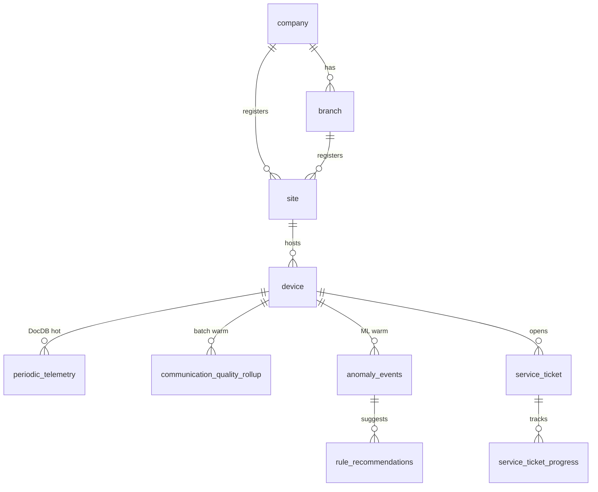

# 12. 데이터베이스 설계 (테크밸리)

3-Tier 저장([03-storage-tiers.md](./03-storage-tiers.md))의 **물리 스키마 SSOT**입니다.  
DDL·컬렉션·Iceberg 정의는 **`02.arch/config/schema/`** 에 두고, manifest·배치·Lambda는 여기를 참조합니다.

## 12.1 설계 원칙

| 원칙 | 내용 |
|------|------|
| **CQRS** | DocumentDB Writer=Lambda 적재, Reader=배치·GET API |
| **장비 키** | 문자열 `device_code`(S/N) = MQTT `topic(4)` = KDS PartitionKey |
| **조직 트리** | `company` → `branch` → `site` → `device` (Warm FK). MQTT는 device만 carry |
| **RDS FK** | 숫자 `device_id` → `device.id` (조회·조인용) |
| **UI 매핑** | `device` ↔ equipment, `company` ↔ customer, `site` ↔ installation/현장 |
| **멱등** | Doc: `(device_code, device_timestamp, data_index)` UK |
| **DLQ** | 배치 실패 → DocumentDB `pipeline_dlq_events` (RDS 아님) |
| **코드표** | `common_code (main_code, sub_code)` — 알람·도메인·권한 |

## 12.2 SSOT 파일 트리

```
02.arch/config/schema/
├── postgres/
│   ├── 01-core-schema.sql          # 마스터·device·OTA·RBAC
│   ├── 02-pipeline-alarm-notification.sql  # 알람·통신품질·롤업·룰셋 미러
│   ├── 04-tv-domain-extensions.sql # 서비스·AI·장비로그 (테크밸리 UI)
│   ├── 05-seed-dev.sql             # HK-2024-00158 등 로컬 시드
│   └── 03-seed-reference.sql     # 풀 더미 (참고)
├── documentdb/
│   ├── collection-contract.md
│   └── document-schema-anchors.md
└── iceberg/
    └── tables.yaml
```

manifest: `manifest/processes/03-documentdb.yaml`, `06-postgres.yaml`

## 12.3 DocumentDB (Hot) — `iot_service`

전체 컬렉션·인덱스: **`03-documentdb.yaml`** (MOBI 파이프라인 계약 이식, 테크밸리 tenant `tv`).

| 컬렉션 | Writer | Reader |
|--------|--------|--------|
| `periodic_telemetry` | stream_sync_consumer | batch rollup, metric-stream |
| `event_history` | stream_sync_consumer | equipment_log_export |
| `control_history` / `fota_history` / `files_history` | stream_sync_consumer | equipment_log_export |
| `device_notifications` | stream_sync_consumer | 알람 raw |
| `telemetry_rollups_device_*` | batch_cadence_runner | API, batch |
| `pipeline_dlq_events` | batch 실패 | batch_dlq_replay |
| `rollup_cursor_periodic_telemetry` | batch | checkpoint |

DocDB ↔ Aurora 링크: `03-documentdb.yaml` → `rdbms_time_series_link` (`device_code`, `device_timestamp`, `base_time`).

## 12.4 Aurora PostgreSQL (Warm) — `iot_analytics`

### 적용 순서

```bash
cd 10.local
./bootstrap-postgres.sh    # 01 → 02 → 04 → 05
```

### 테이블 그룹

| 그룹 | 대표 테이블 | UI |
|------|-------------|-----|
| **core_master** | company, branch, site, device, product | customers, equipment, installation |
| **pipeline_alarm** | communication_alarm_incident, notification, alert | alarms, alarm-rules |
| **telemetry_rollup** | telemetry_site_product_time_series | dashboard, sla |
| **tv_domain** | anomaly_events, rule_recommendations, self_heal_*, service_ticket, equipment_log_* | AI·서비스·장비로그 |
| **media_upload** | media_upload_session, media_upload_part, media_stream_segment, equipment_log_media | inspection, equipment-logs ([13](./13-media-upload-pipeline.md)) |

상세 목록: [06-schema-reference.md](./06-schema-reference.md) · `06-postgres.yaml#table_groups`

### 네이밍 (RDS)

- `*_id` — 숫자 PK/FK
- `*_code` — 문자열 업무키 (`device_code`, `alert_code`)
- `*_type` — `common_code.sub_code` (FK 아님)

## 12.5 Iceberg / S3 / Firehose (Cold)

**SSOT:** [`config/schema/iceberg/lake-config.yaml`](./config/schema/iceberg/lake-config.yaml)

### dev 리소스 (Terraform `name_prefix` = `tv-ingress-dev`)

| AWS | 이름 / 경로 |
|-----|-------------|
| **S3** | `tv-ingress-dev-tv-analytics-raw` |
| **Firehose** | `tv-ingress-dev-cold-stream-events` |
| **Landing** | `s3://…/cold-stream-events/year=YYYY/month=MM/day=DD/` |
| **Errors** | `s3://…/errors/firehose/cold-stream-events/…` |
| **Iceberg warehouse** | `s3://…/iceberg/warehouse/{table}/` |
| **Glue DB** | `techvalley_analytics` |

### 데이터 흐름

```
KDS → stream_sync_consumer → DocumentDB (Hot)
                           └→ Firehose PutRecordBatch (동일 정규화 JSON)
                                → S3 landing (7일)
                                → Glue Spark → Iceberg (90일+)
```

**금지:** KDS → Firehose 직접 병렬 소비 (Raw 혼입).

### 예시 파일

| 파일 | 용도 |
|------|------|
| [firehose_stream_fact.sample.json](./config/samples/firehose_stream_fact.sample.json) | Firehose 1레코드 |
| [iceberg_yield_daily.sample.json](./config/samples/iceberg_yield_daily.sample.json) | 수율 Iceberg 행 |
| [s3-object-layout.example.md](./config/samples/s3-object-layout.example.md) | S3 prefix 트리 |
| [athena-query-examples.sql](./config/samples/athena-query-examples.sql) | Athena SQL |

로컬: MinIO `tv-analytics-raw` — `./10.local/minio-init.sh`

## 12.6 ERD (요약)



조직 롤업: `device.site_id` → `site` → `branch` → `company` · 배치 집계 grain 예: `communication_quality_rollup_site`, `telemetry_company_product_time_series`.

## 12.7 로컬 bootstrap

**전체 E2E**: [16-local-e2e-testing.md](./16-local-e2e-testing.md)

```bash
./10.local/local-up.sh
# 또는 수동:
podman compose -f 10.local/docker-compose.yml up -d
./10.local/bootstrap-postgres.sh
./10.local/bootstrap-documentdb.sh
```

## 12.8 변경 절차

1. `02.arch/config/schema/` 또는 `manifest/processes/03-documentdb.yaml` 수정
2. `npm run compose:manifest --prefix 03.source/lambda`
3. `npm run sync:config --prefix 03.source/lambda`
4. bootstrap 재실행 · `06-schema-reference.md` / 본 문서 갱신

## 12.9 관련 문서

- [03-storage-tiers.md](./03-storage-tiers.md)
- [06-schema-reference.md](./06-schema-reference.md)
- [09-ai-anomaly-rules-and-edge-self-healing.md](./09-ai-anomaly-rules-and-edge-self-healing.md)
- [config/schema/postgres/README.md](./config/schema/postgres/README.md)
- [15-lambda-development.md](./15-lambda-development.md) — Lambda sink·batch write (next)
- [16-local-e2e-testing.md](./16-local-e2e-testing.md)
