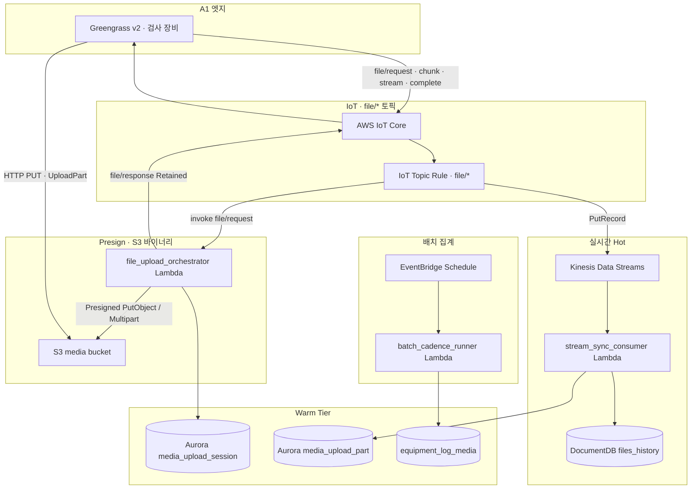
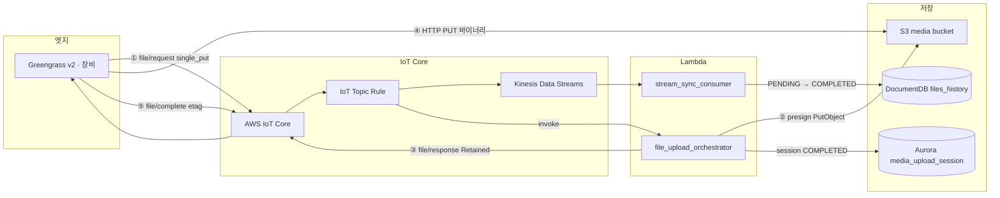
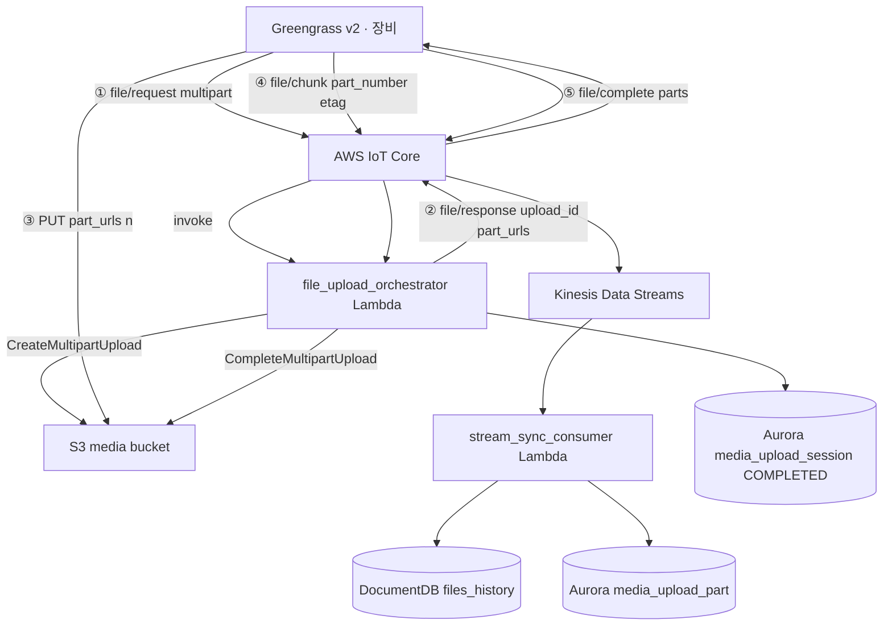
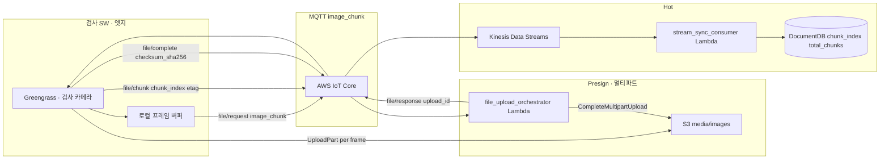
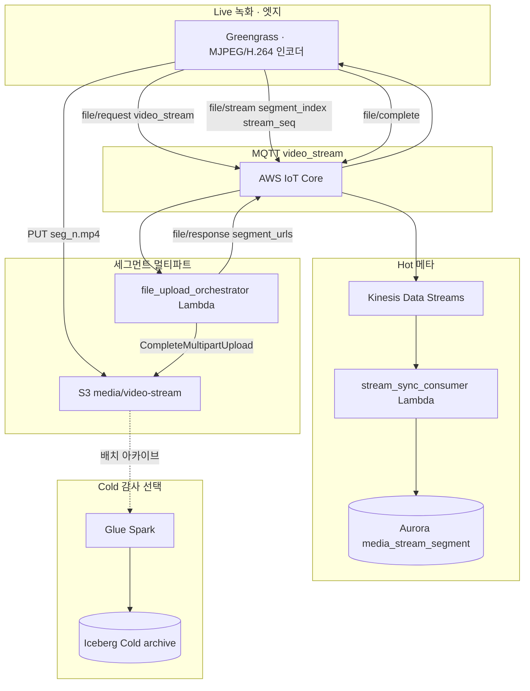

# 13. 미디어 업로드 파이프라인 (이미지·비디오·S3)

검사 **이미지 청크**, **비디오 스트림**, **S3 단일 PUT / 멀티파트** 업로드 SSOT입니다.  
MQTT는 **메타·제어만** — 바이너리는 **Presigned URL → S3 직접 PUT**.

## 13.1 설계 원칙

| 원칙 | 내용 |
|------|------|
| **MQTT ≠ 페이로드** | 이미지/영상 바이트는 S3만 — 토픽은 request·chunk·progress·complete |
| **device_code** | `request_code` + `device_code` + `device_timestamp` 멱등 |
| **오프라인** | 엣지 `files/` 로컬 적재 → 복귀 후 동일 MQTT 시퀀스 ([08-greengrass-offline-resilience.md](./08-greengrass-offline-resilience.md)) |
| **URL 만료** | 1h Presigned — `file/request` 재발행 + `AbortMultipartUpload` |
| **Hot** | DocumentDB `files_history` |
| **Warm** | Aurora `media_upload_session` · `media_upload_part` · `equipment_log_media` |

설정 SSOT: [`config/media-upload.yaml`](./config/media-upload.yaml)

### 13.1.1 전체 아키텍처 (AWS)

MQTT는 **메타·제어만** — 바이너리는 Presigned URL로 **S3 직접 PUT**. 웹 문서에서 AWS 서비스 아이콘이 자동 적용됩니다.



## 13.2 업로드 모드

| 모드 | `upload_mode` | 조건 | S3 API |
|------|---------------|------|--------|
| **단일 PUT** | `single_put` | `file_size_bytes` ≤ 5MB (기본) | `PutObject` Presigned |
| **멀티파트** | `multipart` | 이미지·로그·대용량 | `CreateMultipartUpload` + `UploadPart` |
| **이미지 청크** | `image_chunk` | 검사 프레임 순차 업로드 | 멀티파트 + `chunk_index` 메타 |
| **비디오 스트림** | `video_stream` | MJPEG/H.264 세그먼트 | 멀티파트 + `segment_index` · `stream_seq` |

## 13.3 MQTT 토픽 (domain `file`)

```
tv/{env}/{edge}/{device}/event/file/{role}/json
```

| role | 방향 | 용도 |
|------|------|------|
| `request` | ↑ | 업로드 시작 (single/multipart/chunk/stream 선언) |
| `response` | ↓ | Presigned URL(들) — Lambda 발행, **Retained** |
| `chunk` | ↑ | 이미지 청크·파트 완료 메타 (ETag, part_number) |
| `stream` | ↑ | 비디오 스트림 세그먼트 메타 |
| `progress` | ↑ | 진행률 (선택) |
| `complete` | ↑ | CompleteMultipartUpload 또는 single 완료 |
| `abort` | ↑ | AbortMultipartUpload |

`file_kind` 예: `image/jpeg`, `image/png`, `video/mp4`, `video/mjpeg-stream`, `inspection_log`

## 13.4 단일 PUT 프로세스



## 13.5 멀티파트 프로세스 (이미지·대용량)



## 13.6 이미지 청크 업로드

검사 SW가 프레임 단위로 촬영·업로드할 때:



1. `request`: `upload_mode=image_chunk`, `file_kind=image/jpeg`, `total_chunks`, `chunk_size_bytes`
2. `response`: 멀티파트 `upload_id` + 파트 URL (청크 수만큼 또는 동적 재요청)
3. 각 프레임: 로컬 버퍼 → S3 파트 PUT → `file/chunk` (`chunk_index`, `part_number`, `etag`)
4. `complete`: 최종 조립·`checksum_sha256` 검증

DocumentDB `files_history` 필드: `chunk_index`, `total_chunks`, `frame_timestamp_ms`

## 13.7 비디오 스트림 업로드

Live/준실시간 검사 녹화:



1. `request`: `upload_mode=video_stream`, `codec=mjpeg|h264`, `segment_duration_sec`
2. `response`: 스트림 세션 `upload_id`, 초기 `segment_urls[]`
3. 세그먼트마다: `file/stream` (`segment_index`, `stream_seq`, `duration_ms`, `byte_range`)
4. S3 PUT 후 `file/chunk` 또는 `file/progress`
5. `complete`: 스트림 종료 — Glue/Iceberg 감사 아카이브(선택)

S3 prefix: `media/video-stream/{device_code}/{request_code}/seg_{index}.mp4`

## 13.8 Lambda 역할

| Lambda | 트리거 | 역할 |
|--------|--------|------|
| `stream_sync_consumer` | KDS | MQTT → rules → DocDB `files_history` |
| **`file_upload_orchestrator`** | IoT Rule `file/request` invoke + (선택) EventBridge | Presigned·Create/Complete/Abort Multipart, Aurora session |
| `batch_cadence_runner` | EventBridge | `equipment_log_media` · 세션 집계 |

## 13.9 S3 레이아웃

```
s3://{media_bucket}/
  media/images/{device_code}/{request_code}/object.jpg
  media/images/{device_code}/{request_code}/parts/...
  media/video-stream/{device_code}/{request_code}/seg_00001.mp4
  media/logs/{device_code}/{request_code}/export.tar.gz
  errors/media-upload/{device_code}/...
```

로컬 MinIO: `config/local/minio-init.sh` — `tv-media-upload` 버킷

## 13.10 실패·재시도

| 상황 | 처리 |
|------|------|
| Presigned 403/만료 | `file/request` + `reason=url_expired` → Abort 이전 upload_id |
| 파트 실패 | `file/chunk` status=failed → 동일 part_number URL 재발급 |
| 오프라인 | 엣지 `files/` 보관 → 복귀 후 request부터 재개 ([08](./08-greengrass-offline-resilience.md) §8.4.3) |
| stuck PENDING | 배치 알람 + Runbook Abort |

## 13.11 UI 연동

| 화면 | 데이터 |
|------|--------|
| equipment-logs | `equipment_log_media` — image/video 카테고리 |
| inspection | 검사 프레임·녹화 목록 |
| data-pipeline | 업로드 세션 lag·실패율 |

## 13.12 관련 문서·설정

- [02-data-pipeline.md](./02-data-pipeline.md) · [05-yaml-and-rules.md](./05-yaml-and-rules.md) §5.9 file
- [08-greengrass-offline-resilience.md](./08-greengrass-offline-resilience.md) §8.4.3
- [config/media-upload.yaml](./config/media-upload.yaml)
- [config/converter-rules/rule_file_*.yaml](./config/converter-rules/)
- [config/samples/file_*.sample.json](./config/samples/)
- [15-lambda-development.md](./15-lambda-development.md) — `file-upload-orchestrator` handler·로컬 `test:local:media`
