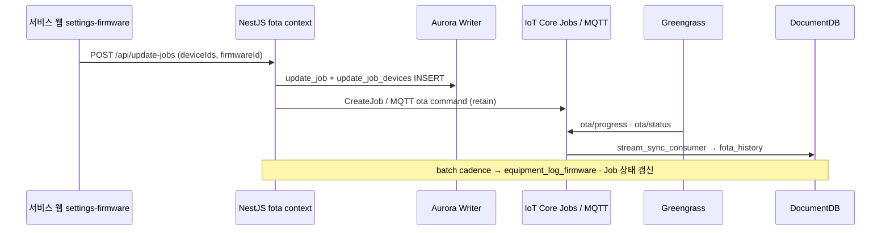

# 14. 백엔드·프론트엔드 설계

테크밸리 **운영 포털(Next.js) + API(NestJS)** 설계 SSOT입니다.  
참고 구현·도메인 상세: **FOTA Lite** (`source/etc/FOTA/30.fota-lite-project`) — 본 문서는 테크밸리 **A1~A12·3-Tier·조직 4단계**에 맞게 재정렬합니다.

관련: [04-backend-services.md](./04-backend-services.md) · [06-schema-reference.md](./06-schema-reference.md) · [config/schema/org-hierarchy.md](./config/schema/org-hierarchy.md) · [08-greengrass-offline-resilience.md](./08-greengrass-offline-resilience.md) (OTA) · [15-lambda-development.md](./15-lambda-development.md) (파이프라인 Lambda — NestJS와 별도)

---

## 14.1 논리 아키텍처 (4계층)

```
┌──────────────────────────────────────────────────────────────────┐
│  채널   관리 콘솔 (admin.*)  │  서비스 웹 (portal.*)               │
├──────────────────────────────────────────────────────────────────┤
│  앱     Next.js 16 (MUI · AG Grid)  ←REST/SSE→  NestJS API       │
├──────────────────────────────────────────────────────────────────┤
│  데이터 Hot DocumentDB │ Warm Aurora Postgres │ Cold Iceberg       │
├──────────────────────────────────────────────────────────────────┤
│  연동   Cognito · IoT Core · KDS/Lambda · EventBridge             │
└──────────────────────────────────────────────────────────────────┘
```

| 계층 | 테크밸리 | FOTA Lite 참고 |
|------|----------|----------------|
| 채널 | 관리 콘솔 + 서비스 웹 (동일 repo, 라우트 그룹 또는 서브도메인) | `docs/fota-lite/01-stack-spec.md` §4.1 |
| API | NestJS · TypeORM → **Aurora PostgreSQL** + Mongo driver → DocumentDB | MySQL → **Postgres로 매핑** |
| Hot | `fota_history`, `periodic_telemetry`, … | `firmware_update_events` |
| Warm | `device`, `update_job*`, `equipment_log_*`, 롤업 | 동일 개념, DDL: `01-core-schema.sql` |

---

## 14.2 UI 채널: 관리 콘솔 vs 서비스 웹

**관리 콘솔**은 «무엇을 허용·배포·버전으로 쓸지», **서비스 웹**은 «지금 장비가 어떻게 돌아가고 문제 시 누가 조치하는지»를 다룹니다.

### 14.2.1 관리 콘솔 (Admin / Platform)

| 영역 | 테크밸리 UI (`menuId`) | API (NestJS · 예정) |
|------|------------------------|---------------------|
| 사용자·RBAC | `admin-users`, `admin-menus` | `/api/admin/users`, `/api/admin/menus` |
| 공통코드 | `admin-codes` | `/api/common-codes` |
| IoT 인증·인증서 | `admin-iot-auth` | `/api/admin/iot/certificates`, Thing registry |
| 토픽·YAML·Rule | (data-pipeline 설정 탭) | `/api/admin/pipeline/rules`, manifest mirror |
| 테넌트·조직 마스터 | `customers`, `installation` | `/api/companies`, `/api/branches`, `/api/sites` |
| 펌웨어·제품 카탈로그 | `settings-firmware` | `/api/products`, `/api/firmwares`, `/api/firmwares/upload` |

역할: `admin` (플랫폼)·`engineer` — `menu-catalog.ts` VIEW_ACCESS.

### 14.2.2 서비스 웹 (Operations Portal)

| 영역 | 테크밸리 UI | scope | API · 소스 |
|------|-------------|-------|------------|
| 통합 관제 | `dashboard` | batch | `/api/dashboard`, `aurora.fleet_hourly_rollup` |
| 데이터 파이프라인 | `data-pipeline` | mixed | `/api/pipeline/status`, Tier snapshot |
| 실시간 스트림 | `metric-stream` | realtime | SSE/WS `/api/metric-stream`, KDS |
| 장비 로그 | `equipment-logs` | batch | `/api/equipment-logs?category=` |
| 알람·룰 | `alarms`, `alarm-rules` | batch | `/api/alarms`, `/api/alarm-rules` |
| 원격 | `remote-diagnosis`, `remote-control` | realtime+batch | IoT Jobs, Shadow |
| 서비스·SLA | `service-tickets`, `service-progress`, `sla` | batch | `/api/service/*`, `/api/sla` |
| 장비·현장 | `equipment`, `installation` | batch | `/api/devices`, `/api/installation` |
| 검사·수율 | `inspection`, `reports` | batch | `/api/inspection`, Iceberg rollup |
| 부품·AS | `parts-*`, `as` | batch | `/api/parts/*`, `/api/as` |
| 알림 설정 | `settings-notifications` | batch | `/api/notifications/settings` |

역할: `admin` · `engineer` · `cs` · `customer` — JWT `companyId` · `branchId` · `siteId`로 **조직 스코프** 필터 ([org-hierarchy.md](./config/schema/org-hierarchy.md)).

### 14.2.3 배포 패턴

| 패턴 | 설명 |
|------|------|
| **단일 repo** | `app/(admin)/…`, `app/(platform)/…` — 현재 `03.source/frontend` 구조 |
| **분리 호스트** | `admin.tv.example.com` / `portal.tv.example.com` — 동일 SSG 빌드, CloudFront behavior |
| **분리 빌드** | 관리 콘솔만 포함한 `NEXT_PUBLIC_APP_CHANNEL=admin` (선택) |

---

## 14.3 백엔드: NestJS 바운디드 컨텍스트

FOTA Lite `apps/backend/src/contexts/` 패턴을 테크밸리 **`03.source/beckend/`** (예정)에 적용합니다.

```
contexts/
├── identity/          # Cognito JWT · users · RBAC · 조직 스코프 claim
├── organization/      # company · branch · site
├── catalog/           # product · firmware (S3 multipart)
├── device/            # device 마스터 · device_phase · history
├── device-group/      # 플릿 그룹 · 일괄 OTA 대상
├── fota/              # update_jobs · IoT Job/MQTT orchestration · DocDB 이벤트
├── pipeline/          # Tier snapshot · KDS lag · cadence status (읽기 전용)
├── telemetry/         # Hot 조회 · metric-stream fan-out
├── alarm/             # 알람 · ruleset mirror · EventBridge
├── service/           # ticket · progress · SLA snapshot
├── inspection/        # 수율 · Iceberg proxy
├── parts/             # 부품 · AS
├── admin/             # IoT cert · YAML deploy · system-config
└── platform/          # DLQ mirror · health
```

각 컨텍스트 하위 폴더 (FOTA Lite 규약):

| 폴더 | 내용 |
|------|------|
| `entities/` | TypeORM 엔티티 — DDL SSOT: `config/schema/postgres/` |
| `controllers/` | HTTP · `*.controller.interface.ts` |
| `services/` | `@Injectable()` · 키셋 페이징 `findPage(limit, lastId)` |
| `modules/` | Nest `*.module.ts` |
| `doc/` | 컨텍스트별 API·업무 규칙 md |

**횡단**: `src/infrastructure/` — MQTT, S3/MinIO, Cognito, DocumentDB, Redis(선택).  
**공통**: `src/common/contracts/` — CRUD·process 포트, CQRS DataSource 선택.

MSA 경계와의 대응: [04-backend-services.md](./04-backend-services.md) §4.1 — 초기에는 **모놀리식 NestJS**, 도메인 모듈 경계만 유지 후 Fleet/Alarm 등 분리.

---

## 14.4 CQRS (Read / Write 분리)

| 구분 | 조건 | DB |
|------|------|-----|
| **Read** | HTTP `GET` · 서비스 `get*` | Aurora **Reader** · DocDB read preference |
| **Write** | POST/PUT/PATCH/DELETE | Aurora **Writer** · DocDB Primary |

환경 변수 예: `POSTGRES_READ_URL`, `POSTGRES_WRITE_URL`, `MONGO_READ_URI`, `MONGO_WRITE_URI`.

- 배치·BI·대시보드 GET → Reader (ReplicaLag 모니터링 — [03-storage-tiers.md](./03-storage-tiers.md) §3.5).
- «방금 쓴 값 즉시 확인»(Job 생성 직후 목록)만 Writer fallback.

---

## 14.5 인증·조직 스코프

### 14.5.1 Cognito JWT (운영)

| claim | 용도 |
|-------|------|
| `role` | `admin` · `engineer` · `cs` · `customer` |
| `companyId` | `company.id` — customers 스코프 |
| `branchId` | `branch.id` — 지점 KPI |
| `siteId` | `site.id` — 현장·installation |
| `scope` | API 세부 권한 (menu-catalog 1:1) |

`system_admin`(플랫폼): 스코프 무시 · 전체 테넌트.

### 14.5.2 FOTA Lite에서 이식한 패턴

| 항목 | FOTA Lite | 테크밸리 적용 |
|------|-----------|---------------|
| 가입·승인 | email verify → admin approve | Cognito + `account_status` 또는 Pre sign-up Lambda |
| Google SSO | `POST /api/auth/google` | Cognito Hosted UI / OIDC |
| 사이트별 회원 | `/system-admin/site-members` | `scope_site_id` + site admin approve |
| API Public | `@Public()` — login, register | `/api/auth/*`, health |

상세: FOTA `docs/domain/02-auth.md`, `docs/fota-lite/08-cognito-auth.md`.

---

## 14.6 UI ↔ API 매핑 (서비스 웹 + 마스터)

프론트 mock 교체 시 **`src/lib/data/batch/*`**, **`src/lib/data/realtime/*`** → OpenAPI 클라이언트.

> **웹 레퍼런스**: `/reference/ui-api/` (UI↔API · NestJS) · `/reference/lambda/` (Lambda 9종)

| UI route | menuId | HTTP (prefix `/api`) | dataScope |
|----------|--------|----------------------|-----------|
| `/dashboard` | dashboard | GET `/dashboard/summary` | batch |
| `/data-pipeline` | data-pipeline | GET `/pipeline/tiers`, `/pipeline/live` | mixed |
| `/metric-stream` | metric-stream | GET `/metric-stream` (SSE) | realtime |
| `/equipment-logs` | equipment-logs | GET `/equipment-logs?category=` | batch |
| `/alarms` | alarms | GET `/alarms` | batch |
| `/alarm-rules` | alarm-rules | GET `/alarm-rules`, `/rule-recommendations` | batch |
| `/remote-control` | remote-control | POST `/remote/shadow`, `/remote/jobs` | realtime |
| `/remote-diagnosis` | remote-diagnosis | GET `/remote/diagnostics` | batch+Hot |
| `/service-tickets` | service-tickets | CRUD `/service/tickets` | batch |
| `/sla` | sla | GET `/sla/snapshots` | batch |
| `/equipment` | equipment | GET `/devices` | batch |
| `/installation` | installation | GET `/sites`, `/installation` | batch |
| `/customers` | customers | CRUD `/companies`, `/branches` | batch |
| `/inspection` | inspection | GET `/inspection/yield` | batch |
| `/settings/firmware` | settings-firmware | CRUD `/firmwares`, POST `/update-jobs` | batch |
| `/admin/iot-auth` | admin-iot-auth | CRUD `/admin/iot/*` | — |

**조직 필터**: 목록 API 공통 query — `companyId`, `branchId`, `siteId`, `productId` (FOTA `devices` API와 동일 패턴).

**응답 메타** (batch): `{ data, meta: { asOf, source, refreshInterval } }` — `DataSourceMeta`.

---

## 14.7 FOTA · 펌웨어 업데이트 도메인

테크밸리는 **Greengrass IoT Jobs + MQTT `ota/*`** ([08-greengrass-offline-resilience.md](./08-greengrass-offline-resilience.md))와 **운영 포털 Job UI**를 함께 씁니다.

### 14.7.1 Warm (RDS)

| 테이블 | 역할 |
|--------|------|
| `product` | 제품군 |
| `firmware` / OTA 아티팩트 메타 | S3 key, checksum, CF URL |
| `device` | 현재 펌웨어 버전 스냅샷 |
| `update_job`, `update_job_device` | Job·대상·상태 (FOTA Lite 동형) |
| `equipment_log_firmware` | Warm 카테고리 로그 |

DDL: `01-core-schema.sql`, `04-tv-domain-extensions.sql`.

### 14.7.2 Hot (DocumentDB)

| 컬렉션 | 역할 |
|--------|------|
| `fota_history` | OTA 진행·상태 이벤트 (`rule_fota_events_v1`) |
| `control_history` | Shadow·Job 제어 |

MQTT: `+/+/+/+/event/fota/+/json` — [05-yaml-and-rules.md](./05-yaml-and-rules.md).

### 14.7.3 Job 생성 → 장비 반영 (시퀀스)



- **CF Signed URL 만료**: `ota/cf-url-request` → orchestrator 재발급 (24h).
- **오프라인**: Job **QUEUED** — 복귀 시 `notify-next` ([08](./08-greengrass-offline-resilience.md) §8.3).
- **시뮬레이션** (로컬/E2E): FOTA Lite `POST /api/update-jobs/:id/simulate` 패턴.

### 14.7.4 운영 vs 비운영

FOTA Job **대상은 운영(고객등록) device만** — `device_phase` = 고객등록(3), `site_id` 필수 (FOTA Lite `docs/domain/01-hierarchy.md` D0001).

---

## 14.8 프론트엔드 스택 (`03.source/frontend`)

| 항목 | 테크밸리 (package.json 기준) | FOTA Lite 참고 |
|------|------------------------------|----------------|
| 프레임워크 | **Next.js 16.2** App Router · **React 19** | Next 14 SSG `output: 'export'` |
| UI | **MUI 9** + **AG Grid Enterprise 35** + Tailwind 4 | shadcn + AG Grid Community |
| 상태 | TanStack Query 5 · react-hook-form · zod | — |
| i18n | ko/en, KST (`locale/`) | 빌드 시점 `languages.json` (선택 이식) |
| 배포 | Vercel | S3 + CloudFront |
| API URL | `NEXT_PUBLIC_API_URL` (예정) | `NEXT_PUBLIC_API_URL` + SSR `API_URL` |
| CORS | API Gateway / NestJS `CORS_ORIGINS` | 동일 |

그리드·컬럼: `src/components/grid/column-defs.tsx`, `viewport-columns.ts` — API 연동 시 DTO 타입만 교체.

---

## 14.9 로컬·연동

| 서비스 | 포트 (예) | 비고 |
|--------|-----------|------|
| Frontend | 3000 | `npm run dev:frontend` |
| NestJS API | 3002 / 17012 | `03.source/beckend` |
| Postgres | 25432 | [07-repo-and-deployment.md](./07-repo-and-deployment.md) |
| DocumentDB Local | 27000 | Hot |
| Mosquitto (선택) | 1883 | `/mqtt` 디버그 UI |

FOTA Lite 스크립트 참고: `start-local.sh`, `local-up.sh` — 테크밸리는 `10.local/` Podman compose SSOT.

---

## 14.10 FOTA Lite ↔ 테크밸리 대응표

| FOTA Lite | 테크밸리 |
|-----------|----------|
| MySQL `companies/branches/sites/devices` | Postgres `company/branch/site/device` |
| `firmware_update_events` (DocDB) | `fota_history` |
| `firmware_update_history` (RDS) | `equipment_log_firmware` + Job 테이블 |
| MQTT 8-level `{tenant}/{env}/…` | `{tv}/{dev\|stg\|prd}/…` — [05-yaml-and-rules.md](./05-yaml-and-rules.md) |
| NestJS stream consumer (로컬) | `stream-sync-consumer` Lambda (운영) |
| `stats_hourly/daily/…` | `telemetry_*_time_series`, `communication_quality_rollup_*` |
| 관리 콘솔 / 서비스 웹 | `admin-*` / `(platform)/*` routes |

**참고 문서 경로** (외부 SSOT, 구현 시 읽기):

| 문서 | 내용 |
|------|------|
| `FOTA/30.fota-lite-project/docs/fota-lite/11-ui-api.md` | UI·API·CORS |
| `FOTA/30.fota-lite-project/docs/fota-lite/01-stack-spec.md` | 스택·CQRS·UI 분리 |
| `FOTA/30.fota-lite-project/docs/domain/01-hierarchy.md` | 조직·device_phase |
| `FOTA/30.fota-lite-project/docs/domain/03-firmware-update.md` | Job·펌웨어 |
| `FOTA/30.fota-lite-project/apps/backend/src/contexts/README.md` | 컨텍스트 구조 |
| `FOTA/10.doc/01-fota-customer-overview.md` | Cognito SSO·고객 기능 개요 |

---

## 14.11 구현 상태

| 항목 | 상태 |
|------|------|
| 프론트 UI + API 연동 (mock 제거) | **done** (`03.source/frontend` · `NEXT_PUBLIC_API_URL`) |
| Lambda pipeline skeleton | **skeleton** (`03.source/lambda`) — [15-lambda-development.md](./15-lambda-development.md) |
| NestJS `03.source/beckend/` | **done** — contexts/ · TypeORM + raw SQL 하이브리드 · DTO |
| TypeORM entities (전 테이블) + CRUD write API | **next** |
| `settings-firmware` → real OTA API | **next** |
